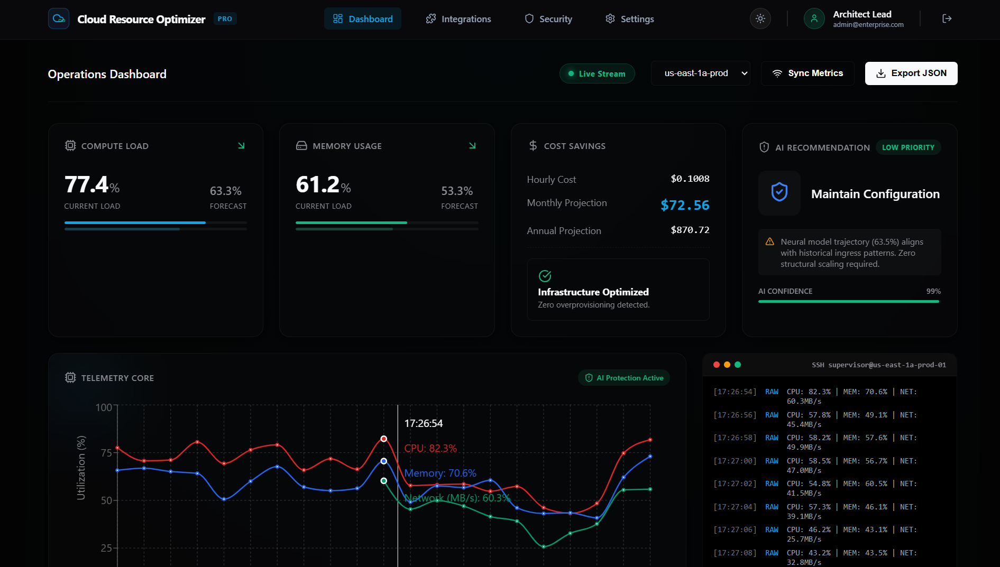

# AI-Driven Real-Time Cloud Resource Optimizer

<p align="left">
  
  
  
  
  
  
</p>

A sophisticated cloud resource optimization platform that uses LSTM neural networks trained on **industry-grade production cluster data** to predict resource utilization and recommend optimal scaling actions — helping organizations maintain performance while minimizing costs.



## Features

### AI-Powered Predictions
- **LSTM Neural Networks** trained on industry-grade production cluster data (500K+ rows)
- **Multivariate Analysis** — CPU, Memory, Network, and Disk I/O as input features
- **Confidence Scoring** with prediction reliability indicators
- **Fallback Predictor** — moving-average when LSTM model is not yet trained

### Real-Time Monitoring
- **Live Metrics Stream** via WebSocket (2-second intervals)
- **Interactive Charts** combining historical + real-time data with Recharts
- **Terminal View** — SSH-style live telemetry log with color-coded alerts
- **Node Health Grid** — per-node status, latency, and IP monitoring

### Cost Optimization
- **Real-Time Cost Calculator** — hourly, monthly, and annual projections
- **Savings Analysis** with percentage indicators and potential savings
- **Rightsizing Recommendations** based on predicted utilization

### Human-in-the-Loop (HITL) Controls
- **AI Auto-Scaling Toggle** — enable/disable AI-driven decisions
- **Hard Node Limit** — enforced max instance constraint as a billing fail-safe
- **Manual Overrides** — force provision (upscale) or deprovision (downscale)
- **Anomaly Reporting** — submit error logs and halt operations

### Multi-Page Application
- **Login** — authentication portal with demo credentials
- **Cloud Setup** — connect AWS, GCP, or Azure with access keys
- **LLM Setup** — configure OpenAI, Anthropic, or Gemini integration
- **Dashboard** — main operations center with all monitoring and controls
- **Security** — IAM sync, encryption status, SSO integration posture
- **Settings** — email alerts, verbose logging, data retention preferences

### Dark/Light Theme
- **Unified Theme System** via React Context — one toggle, consistent everywhere
- **Persistent Preference** saved to localStorage across sessions
- **Full Coverage** — every page, navbar, cards, charts, and terminal adapt

## Architecture

### Backend
- **FastAPI** — modern async Python web framework
- **TensorFlow/Keras** — LSTM model for time-series forecasting
- **SQLAlchemy** — ORM with SQLite (PostgreSQL-ready)
- **WebSockets** — real-time bidirectional communication
- **Pydantic** — request/response validation

### Frontend
- **React 18** with React Router v7
- **Recharts** — interactive chart visualizations
- **Lucide React** — consistent icon system
- **Axios** — HTTP client for API communication
- **ThemeContext** — centralized dark/light mode management

## Quick Start

### Prerequisites
- Python 3.8+
- Node.js 14+
- npm or yarn

### Backend Setup

```bash
cd backend

# Create virtual environment (recommended)
python -m venv venv
source venv/bin/activate        # Linux/Mac
venv\Scripts\activate           # Windows

# Install dependencies
pip install -r requirements.txt

# Start the server
python -m uvicorn main:app --reload --port 8000
```

The API will be available at `http://localhost:8000`
API documentation: `http://localhost:8000/docs`

### Frontend Setup

```bash
cd frontend

# Install dependencies
npm install

# Start the development server
npm start
```

The frontend will be available at `http://localhost:3000`

### Train the LSTM Model (Optional)

The server starts with a fallback predictor by default. To train the full LSTM model:

1. Place your production `machine_usage.csv` data in `backend/data/` (see `backend/data/README.md` for the expected schema)
2. Run:

```bash
cd backend
python train_model.py
```

Training ingests up to 500K rows across 200 machines, runs 50 epochs with early stopping, and saves the model for automatic loading on subsequent server starts.

### Windows Quick Start

```bash
start-backend.bat    # Terminal 1
start-frontend.bat   # Terminal 2
```

### Docker

```bash
docker-compose up
```

## Demo Credentials

| Field    | Value                  |
|----------|------------------------|
| Email    | `admin@enterprise.com` |
| Password | `admin123`             |

Use the **Load Demo Configuration** button on the Cloud Setup and LLM Setup pages to skip entering API keys.

## API Endpoints

### Metrics
- `GET /api/metrics/current` — current real-time metrics
- `GET /api/metrics/history` — historical metrics with pagination
- `GET /api/metrics/predictions` — prediction history

### Predictions
- `GET /api/predict/` — current prediction with CPU/memory history
- `GET /api/predict/action` — detailed action recommendation

### Dashboard
- `GET /api/dashboard/stats` — aggregated dashboard statistics

### WebSocket
- `WS /ws` — real-time metrics stream (updates every 2 seconds)

### Health
- `GET /health` — API health status
- `GET /` — API info and available endpoints

## LSTM Model Details

### Architecture
- **Input**: 10 timesteps x 4 features (CPU, Memory, Network, Disk I/O)
- **Layer 1**: LSTM 64 units, ReLU, return sequences + 20% Dropout
- **Layer 2**: LSTM 32 units, ReLU + 20% Dropout
- **Layer 3**: Dense 16 units, ReLU
- **Output**: Dense 1 unit (predicted CPU utilization)
- **Optimizer**: Adam | **Loss**: MSE | **Metric**: MAE

### Training Data
- **Source**: Industry-grade production cluster telemetry (`machine_usage.csv`)
- **Size**: Up to 500,000 rows, sampled across 200 machines
- **Features**: CPU utilization, memory utilization, network I/O, disk I/O
- **Split**: 80% training / 20% validation
- **Early Stopping**: patience=10 on validation loss

### Fallback Mode
When no trained model is available, predictions use a simple moving-average with trend extrapolation — the server starts instantly without requiring TensorFlow model loading.

## Configuration

Edit `backend/config.py` or set environment variables:

| Setting | Default | Description |
|---------|---------|-------------|
| `scale_up_threshold` | 80 | CPU % to trigger scale-up |
| `scale_down_threshold` | 30 | CPU % to trigger scale-down |
| `cost_per_cpu_hour` | 0.05 | $/hour per CPU unit |
| `cost_per_memory_hour` | 0.01 | $/hour per memory unit |
| `cost_per_instance_hour` | 0.10 | Base $/hour per instance |
| `sequence_length` | 10 | LSTM input timesteps |
| `cors_origins` | `["*"]` | Allowed CORS origins |

## Project Structure

```
cloud-resource-optimizer/
├── backend/
│   ├── main.py                  # FastAPI app, WebSocket, lifespan
│   ├── config.py                # Pydantic settings (env-configurable)
│   ├── database.py              # SQLAlchemy models and session
│   ├── schemas.py               # Pydantic response schemas
│   ├── train_model.py           # Standalone LSTM training script
│   ├── requirements.txt
│   ├── model/
│   │   └── lstm_model.py        # LSTM model (train, predict, fallback)
│   ├── routers/
│   │   ├── metrics.py           # /api/metrics endpoints
│   │   ├── predictions.py       # /api/predict endpoints
│   │   └── dashboard.py         # /api/dashboard endpoints
│   ├── services/
│   │   ├── action_engine.py     # Scaling recommendation engine
│   │   └── cost_calculator.py   # Cost projection logic
│   ├── utils/
│   │   └── simulate_data.py     # Synthetic metrics generator
│   └── data/
│       ├── README.md            # Data schema and setup instructions
│       └── machine_usage.csv    # (gitignored) Production cluster data
├── frontend/
│   ├── package.json
│   ├── src/
│   │   ├── App.js               # Router and ThemeProvider setup
│   │   ├── App.css              # Global styles and body theming
│   │   ├── ThemeContext.js       # Shared dark/light mode context
│   │   └── components/
│   │       ├── Login.js         # Auth portal with demo fill
│   │       ├── CloudSetup.js    # Cloud provider configuration
│   │       ├── LlmSetup.js     # LLM provider configuration
│   │       ├── Dashboard.js     # Main operations dashboard
│   │       ├── Security.js      # Security posture display
│   │       ├── Settings.js      # App preferences
│   │       ├── Navbar.js        # Global navigation + theme toggle
│   │       ├── Chart.js         # Recharts time-series chart
│   │       ├── MetricCard.js    # CPU/Memory metric display
│   │       ├── ActionCard.js    # AI recommendation card
│   │       ├── CostCard.js      # Cost analysis card
│   │       ├── Auth.css         # Login/setup page styles
│   │       ├── Dashboard.css    # Dashboard and card styles
│   │       └── Navbar.css       # Navigation bar styles
├── Dockerfile                   # Backend Docker image
├── docker-compose.yml           # Full-stack Docker setup
├── start-backend.bat            # Windows backend launcher
├── start-frontend.bat           # Windows frontend launcher
├── start-backend.sh             # Linux/Mac backend launcher
├── start-frontend.sh            # Linux/Mac frontend launcher
├── RUN_INSTRUCTIONS.md          # Detailed run guide
├── TENSORFLOW_FIX.md            # TensorFlow troubleshooting
└── README.md
```

## Troubleshooting

### TensorFlow Import Error on Windows
If you see `ImportError: DLL load failed`, install the Visual C++ Redistributable or use:
```bash
pip install tensorflow-cpu
```
See [TENSORFLOW_FIX.md](TENSORFLOW_FIX.md) for detailed solutions.

### Port Already in Use
```bash
# Windows
netstat -ano | findstr :3000
taskkill /PID <PID> /F

# Linux/Mac
lsof -i :3000
kill -9 <PID>
```

### Model Issues
Delete `backend/models/lstm_model.h5` and restart to use fallback mode, or run `python train_model.py` to retrain.

## Future Roadmap

- [ ] Real cloud provider API integrations (AWS CloudWatch, Azure Monitor, GCP Monitoring)
- [ ] JWT authentication with backend validation and route guards
- [ ] LLM-powered natural language recommendations
- [ ] PostgreSQL for production database
- [ ] Anomaly detection with alerting (Slack, PagerDuty, email)
- [ ] Reserved Instance / Savings Plan recommendations
- [ ] Terraform/IaC integration for auto-remediation
- [ ] Role-based access control (RBAC)
- [ ] Responsive mobile design
- [ ] Audit trail and compliance reporting
- [ ] Multi-cloud cost aggregation dashboard

## Author

**Aayush Sharma**

*B.Tech Computer Science & Engineering (AI & ML)*

*Manipal University Jaipur*

## License

This project is open source and available under the MIT License.
